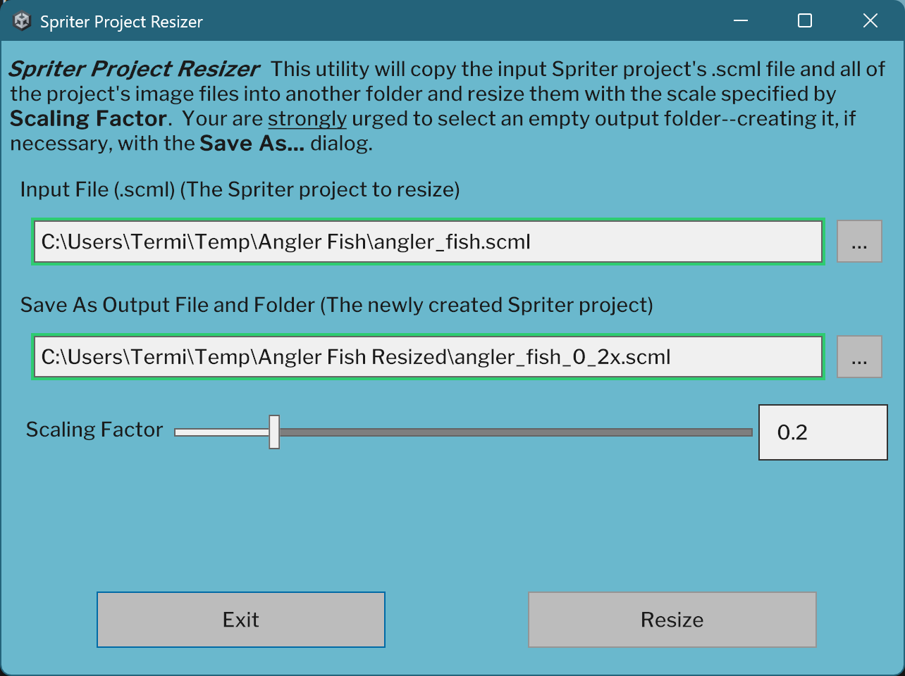

# Spriter Project Resizer

## Description

This is a Windows utility that will resize a .scml Spriter project and all of the images that the .scml file refers to.  It is functionally identical to Spriter Pro's `Save as resized project` feature.

## Where to Get the Utility, How to Install it, and How to Run it

1. Grab the latest release from [here.](https://github.com/TerminalJack/SpriterResizer/releases)
2. Extract all files into a folder of your choice.
3. Double-click `Spriter Project Resizer.exe` to launch the application.

## The `Resize Spriter Project` Utility

Many commercial Spriter projects include oversized image files--far larger than needed for typical game use. Simply resizing these images with third-party tools isn’t enough: the Spriter .scml file must also be updated to reflect the new dimensions.

This utility scales an entire Spriter project--from 5% to 95% of its original size--by generating resized images and updating the .scml file accordingly.

>If you're not satisfied with the image quality produced by the utility, you can replace the resized images using your preferred image editor once you have generated an updated .scml file with the utility.
>
>Because the .scml file now reflects the new dimensions, just ensure you apply the same scaling factor used during the initial resize so that the images are of similar size.  The images that your image editor produces don't need to have the *exact* same dimensions.  They should work fine so long as they are within a pixel or two.

## How to Use the Utility

Launch `Spriter Project Resizer.exe`.  The utility's main screen is shown below.

>The application's window is resizable and the content is reactive--that is, it will resize itself based on the window's size.  The border is just a couple of pixels wide, however, and it can be difficult to grab precisely with the mouse.

Enter the path to the .scml file that is being resized.  You can manually enter the file path or use the `…` button to select it using your OS file browser.

The `Save As Output File and Folder` field allows you to select both the output file name and the folder to save it--and all of the resized images--to.  Use the `…` button to use your OS file browser.  (This is the `Save As` dialog box.)  At this point, you are **strongly advised** to use the file browser to create a **new** folder and select that folder as the output folder.  Type in a name for the new .scml file and click `Save`.

At this time, double-check the `Save As Output File and Folder` field.  Several dozen image files will be written to this folder so make sure it is correct.

Finally, select the scaling factor for the generated output.

Once both the `Input File` field and the `Save As Output File and Folder` field are filled-out and valid, the `Resize` button will be enabled.

Click the `Resize` button to generate the output.

The utility will resize the project and print the status of the conversion.  (See below.)  Once the conversion is complete, the `OK` button will be enabled.  Clicking it will take you back to the main screen where you can resize other projects.

## Credits

This application uses the [Unity Standalone File Browser.](https://github.com/gkngkc/UnityStandaloneFileBrowser)  Thank you, [gkngkc](https://github.com/gkngkc), for the excellent tool.

## License

This project is licensed under the MIT License (SPDX-License-Identifier: MIT).

### Third-Party Notices

- UnityStandaloneFileBrowser — MIT License